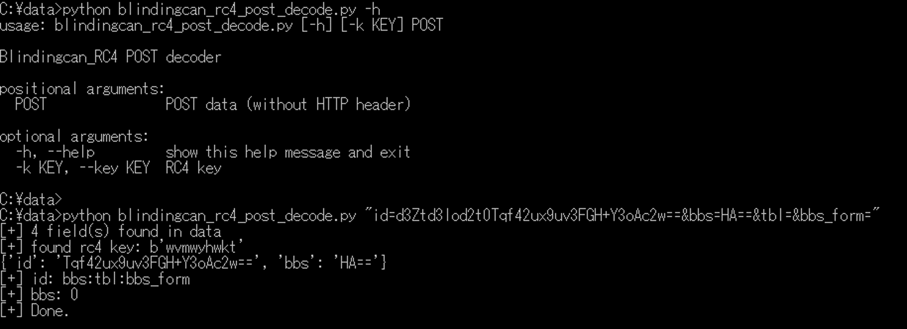
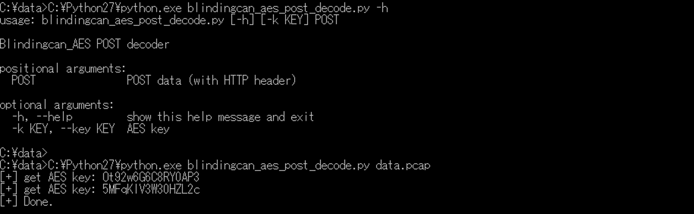

# Lazarus Research

This repository publishes analysis reports and analysis tools for Operation Dream Job and Operation JTrack for Lazarus.

## Tools

Python tools for analyzing malware.

### blindingcan_rc4_post_decode.py

Python script to decode URL parameter for BLINDINGCAN_RC4.

### blindingcan_aes_post_decode.py

Python to decode POST data for BLINDINGCAN_AES.

## Research results

### Slides

* Hitcon 2021
  - https://github.com/JPCERTCC/Lazarus-research/blob/main/slides/HITCON2021_Anatomy-of-COBRA.pdf

* CODE BLUE 2021
  - https://github.com/JPCERTCC/Lazarus-research/blob/main/slides/CODEBLUE2021_The-Lazarus-Groups-Attack-Operations-Targeting-Japan.pdf

### TTPs

* MITRE ATT&CK® Mapping for Lazarus Group
  - https://github.com/JPCERTCC/Lazarus-research/blob/main/TTP/MITRE_ATT%26CK_Mapping.md
